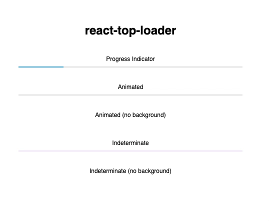

# react-top-loader

> Simple fixed-to-top progress bar / loader component for React (similar to sites like GitHub, Medium etc.)

[](https://www.npmjs.com/package/react-top-loader)



## Installation

```
npm install react-top-loader
```

or

```
yarn add react-top-loader
```

## Usage

- Just import `TopLoader` and set the `show` prop to `true`. This will show the indeterminate
  loader with looping animation at the top of the page.
- Use the `progress` prop to control the animation manually.
- The loading bar is fixed to top by default. Set `fixed` to `false` to disable it.

Here are some more examples:

```javascript
import TopLoader from "react-top-loader";

const Examples = () => (
  <div>
    {/* Fixed to Top with looping animation */}
    <TopLoader show color="#61d800" />

    {/* Progress Indicator */}
    <div style={{ padding: 16 }}>
      <TopLoader show progress={0.2} fixed={false} backgroundColor="#ddd" />
    </div>

    {/* Animated */}
    <div style={{ padding: 16 }}>
      <Animator
        color="#61d800"
        fixed={false}
        backgroundColor="#ddd"
        progressDuration={400}
      />
    </div>

    {/* Indeterminate */}
    <div style={{ padding: 16 }}>
      <TopLoader backgroundColor="#eee6ff" show fixed={false} color="#0000e4" />
    </div>

    {/* Indeterminate (no background) */}
    <div style={{ padding: 16 }}>
      <div>Indeterminate (no background)</div>
      <TopLoader color="#D32F2F" show fixed={false} duration={2500} />
    </div>
  </div>
);

// Helper class to animate the loader
class Animator extends React.Component {
  state = { progress: 0 };

  componentDidMount() {
    setInterval(
      () => this.setState({ progress: Math.min(1, this.state.progress + 0.1) }),
      400
    );
  }

  render() {
    return <TopLoader show progress={this.state.progress} {...this.props} />;
  }
}
```

## Props

| Prop               | Type                                 | Default         | Required | Description                                                                                                       |
| ------------------ | ------------------------------------ | --------------- | -------- | ----------------------------------------------------------------------------------------------------------------- |
| `show`             | `boolean`                            | `false`         | yes      | Set this to `true` to show the loader                                                                             |
| `progress`         | `null (or) number` (between 0 and 1) |                 | no       | If `undefined` or `null`, indeterminate animated loader is shown. If specified, a fraction of the strip is filled |
| `fixed`            | `boolean`                            | `true`          | no       | If `true`, loader is shown at the top of the page (`position:fixed`). Otherwise you have to position it yourself  |
| `thickness`        | `number`                             | `2`             | no       | Thickness (height) of the loading strip in pixels (`px`)                                                          |
| `color`            | `string`                             | `"#03a9f4"`     | no       | Color of the loading strip                                                                                        |
| `backgroundColor`  | `string`                             | `"transparent"` | no       | Color of the empty region behind the loading strip (transparent by default)                                       |
| `delay`            | `number` (milliseconds)              | `0`             | no       | Show the loader after a specified delay (use this to prevent flashing of loader of very short tasks/requests)     |
| `duration`         | `number` (milliseconds)              | `1500`          | no       | Duration of the animation of the indeterminate loader (not applicable if `progress` is provided)                  |
| `progressDuration` | `number` (milliseconds)              | `400`           | no       | If you're changing the value of `progress` to animate the loader, then use this to control the speed of animation |
| `zIndex`           | `number`                             | `10000`         | no       | Z-Index of the top-level loader `div`                                                                             |
| `className`        | `string`                             |                 | no       | Specify a custom class for the top-level `div`                                                                    |
| `style`            | `object`                             |                 | no       | Override styles for the top-level `div`                                                                           |

## Credits

Developed by the [Jovian.ml](https://www.jovian.ml) team. Released under the MIT Licence. Inspired by [this Codepen example](https://codepen.io/bootpen/pen/WQQLQZ) by Shahen Algoo.
